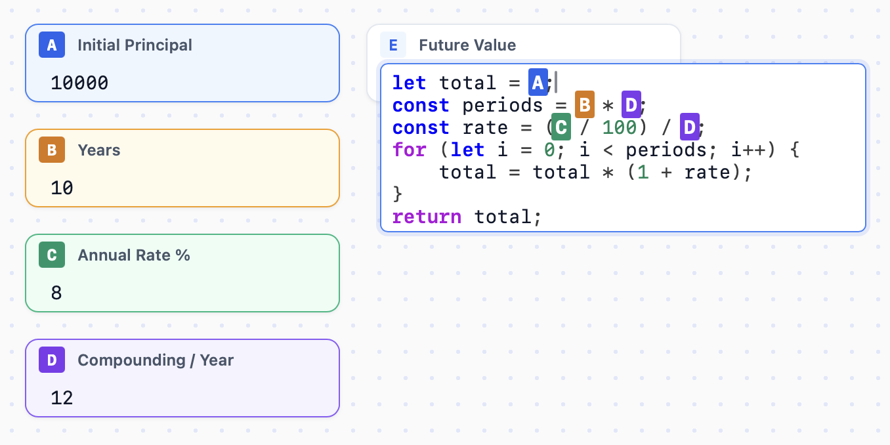

# 📊 JsFuncSheet

JsFuncSheet is a visual, reactive calculator board that blends spreadsheet formulas with JavaScript flexibility. You can define variables in absolute-positioned nodes on a flat canvas, wire formulas using variables or external JavaScript logic, and evaluate compound structures dynamically.



## ✨ Features

- **🛡️ Custom Tokenized Syntax Highlighting**: A custom lexical parser simulates the VS Code Light+ highlighting theme.
- **⚡ VS Code Indentation & Bracket Auto-completion**: Emulates professional text editor logic with key hooks:
  - Smart tabulations using 4 spaces.
  - Bracket pair validation and enclosure auto-completion for `{}`, `[]`, `()`, `"`, `'`, and `` ` ``.
  - Auto-deletion of bracket pairs on `Backspace`.
  - Auto-indentation following nesting brackets when pressing `Enter`.
- **🛠️ Strict JavaScript Mode Formulas**: Supports complex JavaScript in calculation fields, enabling loops, block declarations, and conditional blocks (e.g. `let total = A; for (let i = 0; i < 5; i++) { ... } return total;`).
- **🔍 Circular Dependency Tracer & Tooltips**: Instantly spots circular reference paths (e.g., `E -> D -> E`) and displays detailed evaluation error diagnostics inside custom styled tooltips.
- **🧭 Cmd-Navigate (Visual Navigation Links)**: Tap `Cmd` or `Control` and hover over a highlighted variable inside code text to dim other cells and highlight targets. Click to instantly focus that variable card's input.
- **🎯 Persistent Workspace**: Automatically saves and loads your dynamic boards and active environment layout configurations from local storage.

## 🚀 Getting Started

Ensure you have [Bun](https://bun.sh) (or Node.js) installed options.

### Installation

1. Install development dependencies:
   ```bash
   bun install
   ```

2. Start the hot-reloading development server:
   ```bash
   bun run dev
   ```

3. Build production assets:
   ```bash
   bun run build
   ```

## 📜 Scripts Reference

- `bun run dev` - Launches hot-reload dev server with Vite.
- `bun run build` - Compiles TypeScript and runs static assets build.
- `bun run lint` - Lints and reports source formatting issues.
- `bun run format` - Standardizes source structures and fixes formats using Biome.
